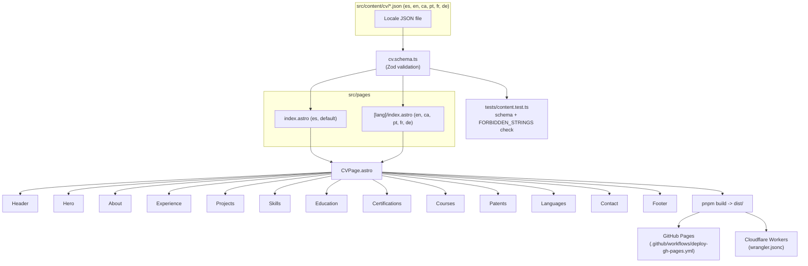

# CV Personal

Personal CV / portfolio site built with [Astro](https://astro.build) and [Tailwind CSS](https://tailwindcss.com), rendered statically and deployed to both GitHub Pages and Cloudflare Workers. Content is fully data-driven and localized into 6 languages (es, en, ca, pt, fr, de).

## Stack

- **Astro 7** — static site generation, `[lang]` dynamic routing
- **Tailwind CSS** — styling, with `class`-based light/dark theme
- **Zod** — schema validation for all CV content
- **Vitest** — content/schema tests
- **pnpm** — package manager (this project does not use npm)

## Requirements

- Node.js 22+
- pnpm 9+

## Getting started

```bash
pnpm install
pnpm dev       # http://localhost:4321
```

## Scripts

| Command        | Purpose                                  |
| -------------- | ----------------------------------------- |
| `pnpm dev`             | Start the local dev server                                  |
| `pnpm build`           | Type-check content and build to `dist/`                     |
| `pnpm preview`         | Preview the production build locally                        |
| `pnpm test`            | Run the Vitest content/schema test suite                     |
| `pnpm run changelog`   | Write commits since the last git tag into `CHANGELOG.md`     |
| `pnpm run deploy`      | Build and deploy to Cloudflare Workers                       |
| `pnpm run release:patch` / `release:minor` / `release:major` | Bump version, update `CHANGELOG.md`, tag, push (triggers GitHub Pages), and deploy to Cloudflare — all in one step |

## Architecture

Each locale is a single JSON file validated against one Zod schema. A component per CV section reads the validated data and renders it; routing swaps only the JSON source per language.



## Content model

- All CV content lives in `src/content/cv/{lang}.json`, one file per locale.
- `src/content/cv.schema.ts` defines the Zod schema every locale file must satisfy (hero, about, experience, featuredProjects, skills, education, certifications, patents, courses, languages, contact, ui).
- `tests/content.test.ts` validates every locale file against the schema and enforces a `FORBIDDEN_STRINGS` blocklist that prevents personal data (national ID, home address, private phone numbers) from ever being committed or rendered. Only email, LinkedIn, GitHub, and Stack Overflow are allowed as contact info.
- Adding a new CV field means: update the schema, then add the field to all 6 locale JSON files, then render it from a component.

## Internationalization

- Supported locales: `es` (default), `en`, `ca`, `pt`, `fr`, `de` — defined in `src/i18n/langs.ts`.
- The default locale (`es`) is served at `/`; other locales are served at `/{lang}/` (e.g. `/en/`).
- `LanguageSwitcher.astro` links between locales using `getLocalizedPath`.

## Theming

Light/dark mode uses Tailwind's `class` strategy. An inline script in `BaseLayout.astro` applies the theme before first paint to avoid a flash of unstyled content, and `ThemeToggle.astro` toggles the `dark` class and persists the choice to `localStorage`.

## Deployment

- **GitHub Pages**: `.github/workflows/deploy-gh-pages.yml` builds on every push to `main` with `DEPLOY_TARGET=gh-pages` (sets the `/cv-personal` base path) and publishes `dist/`.
- **Cloudflare Workers**: `wrangler.jsonc` serves the built `dist/` directory as static assets. Deploy manually with `pnpm run deploy`.

## Releasing

```bash
pnpm run release:patch   # or release:minor / release:major
```

This bumps the version in `package.json`, regenerates `CHANGELOG.md` from the commits since the last tag (via pnpm's `version` lifecycle hook), commits and tags the release, pushes to `main` (which triggers the GitHub Pages workflow), and deploys to Cloudflare Workers.

To update the changelog without cutting a release, run `pnpm run changelog`.

## Testing

```bash
pnpm test
```

Runs schema validation and the personal-data blocklist check for every locale file. This must stay green before any content change is committed.
